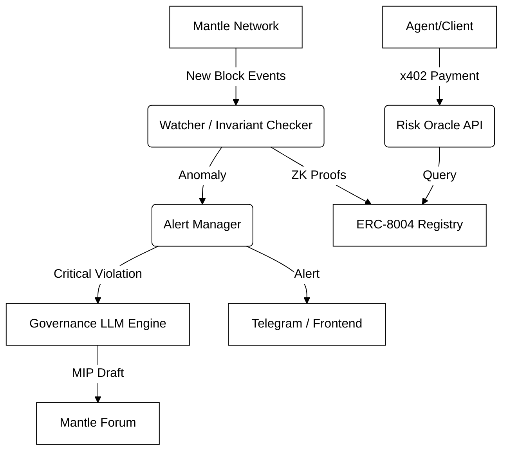
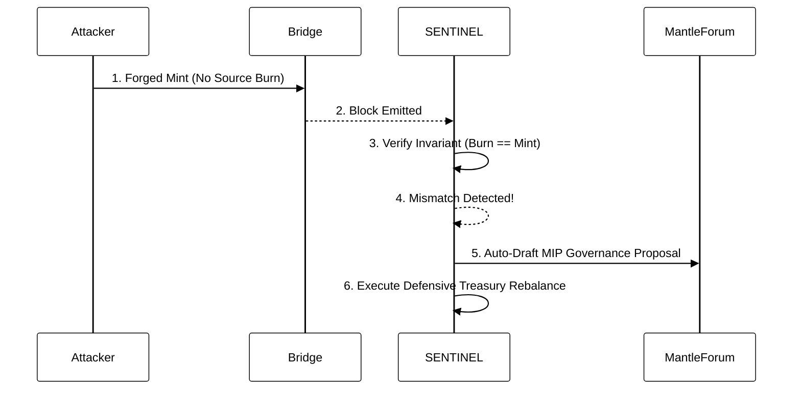

# SENTINEL

An autonomous AI agent that detects cross-chain bridge exploits on Mantle in seconds, automatically drafts governance proposals to mitigate treasury risk, and sells validated risk data via x402 micro-payments.

## Architecture

## Exploit Response Workflow

## Getting Started
1. Run backend: `cd backend && pnpm dev`
2. Run frontend: `cd frontend && pnpm dev`
3. View Monitor: `http://localhost:3000`
