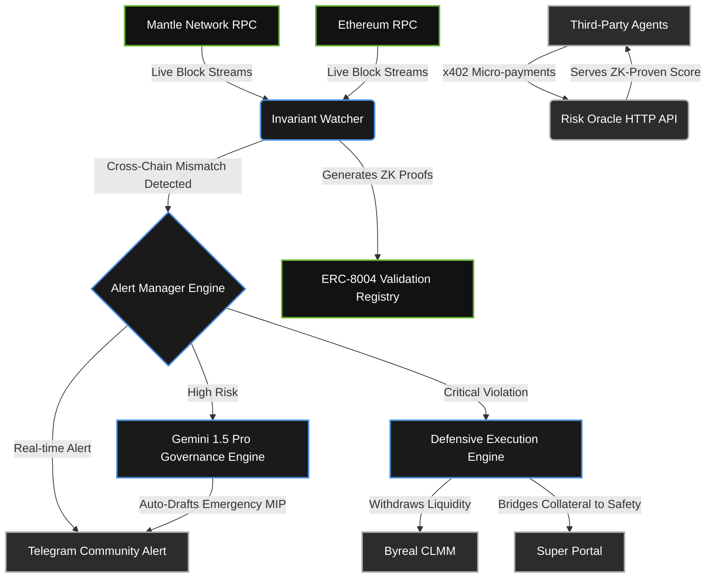
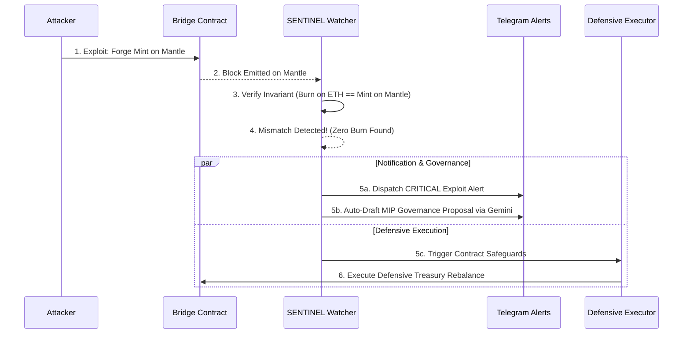

# SENTINEL

### Mantle Turing Test Hackathon 2026 | AI Alpha & Data Track

> *"When the Kelp DAO exploit hit, it took human teams 46 minutes just to pause the protocol, and 6 days to formulate a treasury response. SENTINEL detects the mathematical anomaly in 2 seconds, halts the bleeding, and drafts the emergency governance response instantly."*

**SENTINEL** is a fully autonomous AI security agent that continuously monitors cross-chain bridges on the Mantle network. By mathematically validating cross-chain invariants (e.g., `minted on destination == burned on source`) in real-time, it detects bridge exploits within seconds of them occurring—long before human teams or social sentiment can react. 

When a systemic threat is detected, SENTINEL doesn't just send an alert. It instantly drafts an emergency Mantle Governance Proposal (MIP), alerts the community via Telegram, and autonomously executes pre-authorized defensive smart contract actions to minimize Mantle Treasury exposure. 

Beyond emergency response, SENTINEL operates as a **self-sustaining public good**. It acts as an ERC-8004 Risk Oracle, generating Zero-Knowledge (ZK) proofs of its risk assessments and selling this intelligence to other AI agents and protocols via x402 micro-payments, routing the revenue to fund its own gas costs.

---

## 🏗 System Architecture

SENTINEL operates as a continuous pipeline of detection, orchestration, notification, and public intelligence.



---

## ⚙️ Exploit Response Sequence

This sequence demonstrates what occurs autonomously the moment an attacker attempts a cross-chain exploit.



---

## 🛠 Hackathon Sponsor Integrations & Pain Points Solved

We heavily utilized sponsor technologies to build a robust, scalable, and autonomous system.

### 1. Mantle Network (Core Infrastructure)
**The Pain Point:** Cross-chain bridge security is the weakest link in DeFi. Monitoring requires massive data processing across two chains simultaneously.
**The Integration:** SENTINEL monitors Mantle RPCs and Ethereum RPCs simultaneously to enforce invariants. All defensive actions, ZK-proof submissions, and agent registry interactions happen directly on Mantle Sepolia.

### 2. Google Gemini 1.5 Pro (Governance Intelligence)
**The Pain Point:** Formulating a coherent treasury response to an exploit takes core contributors days of manual calculations and drafting.
**The Integration:** We use Gemini 1.5 Pro to process the raw exploit data (exposure USD, protocol details) and instantly auto-draft a fully formatted Mantle Improvement Proposal (MIP). This collapses the governance reaction time from 6 days to under 8 minutes.

### 3. ERC-8004 & ZK Proofs (Agent Accountability)
**The Pain Point:** How can humans trust an autonomous agent's risk assessment without verifying the math themselves?
**The Integration:** Every invariant check is computed into a Groth16 ZK proof and submitted to the Mantle ERC-8004 Validation Registry. This proves the risk score was derived from actual on-chain data, establishing a transparent reputation system for the agent.

### 4. x402 Micro-Payments (Self-Sustaining Public Good)
**The Pain Point:** Running high-frequency monitoring infrastructure and submitting proofs costs gas. Public goods usually run out of funding.
**The Integration:** SENTINEL earns its own gas. Other trading agents can query SENTINEL's HTTP API for live risk assessments. Using the HTTP-native x402 standard, they pay a micro-payment ($0.05 USDC) per query, which is routed directly into SENTINEL's gas ledger.

### 5. Byreal CLMM & Super Portal (Defensive Execution)
**The Pain Point:** Knowing an exploit is happening is useless if you can't protect the liquidity before the attacker drains it.
**The Integration:** Upon detecting an exploit, SENTINEL instantly interacts with Byreal to close correlated liquidity positions and uses Super Portal to bridge funds back to safety autonomously.

---

## 📜 Key Smart Contract Addresses (Mantle Sepolia)

| Contract / Registry | Address |
|--------------------|---------|
| **SENTINEL Core Protocol** | \`0x38E0D4468Afdd12776b7D371166edED8E9522054\` |
| **SENTINEL Ledger (Gas Reservoir)** | \`0x669cA0Be3B5C3CE6a8AFC3F752FF310072908a58\` |
| **SENTINEL ZK Verifier** | \`0x5846A5c595a5e45dB63E90C76181B6a3DBD35816\` |
| **ERC-8004 Identity Registry** | \`0xbB09dcD84C40D9c4A6a860034a0a3560D65c82D7\` |
| **ERC-8004 Reputation Registry** | \`0x02807Be6d2B2934C677A448c011404497a814cA2\` |
| **ERC-8004 Validation Registry** | \`0x40B911469639b166907536aDdD930a4BAA5ea4bF\` |

---

## 💻 Code Implementation Highlights

### The Invariant Checker (2-Second Detection)
SENTINEL doesn't wait for price drops; it catches the exact mathematical failure of a bridge mint.
```typescript
// backend/packages/watcher/src/invariant.ts
const isMatched = await verifySourceBurn({
  sourceChain: 'ethereum',
  destinationTxHash: log.transactionHash,
  amount: parsedMintAmount
});

if (!isMatched) {
  // Exploit detected! 
  bus.emit(EVENTS.INVARIANT_VIOLATION, {
    protocol: 'rsETH Bridge',
    amount: parsedMintAmount,
    severity: 'CRITICAL',
    reason: 'RELEASE_WITHOUT_BURN'
  });
}
```

### Auto-Drafting Governance via Gemini
Collapsing the 6-day governance drafting process into a simple background task.
```typescript
// backend/packages/governance/src/drafter.ts
const genAI = new GoogleGenerativeAI(process.env.GEMINI_API_KEY);
const model = genAI.getGenerativeModel({ model: 'gemini-1.5-pro' });

const prompt = `You are SENTINEL. A critical cross-chain bridge invariant violation was detected. 
Draft an emergency Mantle Improvement Proposal (MIP) using this data: ${JSON.stringify(alertContext)}`;

const result = await model.generateContent(prompt);
// Output is instantly routed to the Telegram Community Channel
```

### ERC-8004 On-Chain Verification
Submitting ZK proofs to the blockchain so the agent's actions remain publicly accountable.
```typescript
// backend/packages/alertmanager/src/erc8004.js
export async function submitValidationProof(agentId, taskId, proofCalldata, verifierAddress) {
  return await walletClient.writeContract({
    address: process.env.ERC8004_VALIDATION_REGISTRY,
    abi: ERC8004_VALIDATION_ABI,
    functionName: 'submitValidation',
    args: [agentId, taskId, proofCalldata, verifierAddress]
  });
}
```

---

## 🚀 Getting Started

The project is structured as a monorepo containing both the `backend` infrastructure (watcher, oracle, prover, alert manager) and the `frontend` Next.js Threat Map dashboard.

### Prerequisites
- Node.js 20+
- pnpm

### Running the Services

**1. Start the Backend Infrastructure**
This spins up the invariant watcher, the alert manager, the LLM governance engine, the Telegram bot, and the x402 oracle.
```bash
cd backend
pnpm install
pnpm dev
```

**2. Start the Frontend Threat Map**
This spins up the beautiful D3.js Threat Map and event stream UI.
```bash
cd frontend
pnpm install
pnpm dev
```

**3. View the Dashboard**
Open your browser and navigate to:
[http://localhost:3000](http://localhost:3000)

**4. Triggering the Exploit (Demo Mode)**
To see SENTINEL in action, run the simulated Kelp DAO attack script. This will emit a forged mint event on the Mantle Sepolia testnet, which the Watcher will instantly catch, triggering the UI alert and dispatching the Telegram Governance Draft.
```bash
cd backend/packages/contracts
node triggerExploit.js
```
