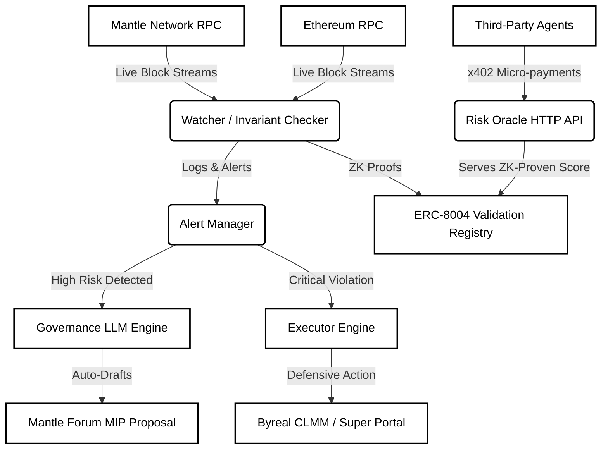
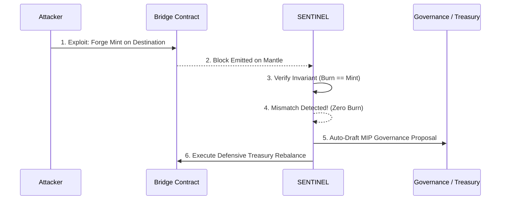

# SENTINEL

### Mantle Turing Test Hackathon 2026 | AI Alpha & Data Track

> *"Kelp DAO's team detected the exploit in 46 minutes. SENTINEL detects it in 2 seconds."*

SENTINEL is a fully autonomous AI agent that continuously monitors cross-chain bridges on the Mantle network. By mathematically validating cross-chain invariants (e.g. `minted == burned`) in real-time, it detects exploits within seconds of them occurring—long before human teams can react. When a systemic threat is detected, SENTINEL instantly drafts a Mantle Governance Proposal (MIP) to defensively reposition the Mantle Treasury and automatically executes pre-authorized smart contract actions to minimize collateral damage.

Beyond emergency response, SENTINEL operates as a self-sustaining public good. It acts as an ERC-8004 Risk Oracle, selling its ZK-proven risk assessments to other AI agents and protocols via x402 micro-payments, using the revenue to fund its own gas costs.

---

## The Core Problem

On April 18, 2026, the Kelp DAO rsETH bridge exploit drained $292 million. The attackers forged cross-chain messages that appeared legitimate on-chain, and the Ethereum-side bridge contract released 116,500 rsETH to the attacker without any corresponding burn or lock event on the source chain.

The exploit was fundamentally a violation of a cross-chain invariant: `tokens_released_on_destination = tokens_burned_or_locked_on_source`. By the time the protocol was paused 46 minutes later, the damage was irreversible.

**SENTINEL solves this gap.** It collapses the detection time from 46 minutes to 2 seconds by monitoring invariants on every single block.

---

## 🏗 System Architecture

The following diagram illustrates how SENTINEL operates as a continuous pipeline of detection, orchestration, governance, and public intelligence.



---

## ⚙️ Exploit Response Workflow

This sequence demonstrates what occurs autonomously the moment an attacker attempts a cross-chain exploit.



---

## 🛠 Features & Technology Stack

### 1. Autonomous Governance Engine (LLM)
When critical risk thresholds are crossed, SENTINEL fetches the affected protocol's exposure data via Nansen APIs, treasury balances, and current yields, and passes them into an Anthropic/OpenAI LLM prompted specifically with the Mantle MIP-34 template. This generates structured, mathematically accurate governance responses in 8 minutes instead of 6 days.

### 2. ERC-8004 Public Risk Oracle
Every invariant check SENTINEL performs is computed into a Groth16 ZK proof. These proofs are submitted to Mantle's ERC-8004 Validation Registry, proving that the risk score was derived from actual on-chain data without human fabrication.

### 3. x402 Micro-Payment Economy
SENTINEL earns its own gas. Other agents (like trading bots) can query SENTINEL's HTTP API for live risk assessments. Using the HTTP-native x402 standard, they pay $0.05 USDC per query. The revenue is routed directly into SENTINEL's gas reservoir.

---

## 🚀 Getting Started

The project is structured as a monorepo containing both the `backend` infrastructure (indexer, watcher, oracle, prover) and the `frontend` Next.js Monitor dashboard.

### Prerequisites
- Node.js 20+
- pnpm
- Docker (for PostgreSQL indexer)

### Running the Services

**1. Start the Backend Infrastructure**
This spins up the database, the invariant watcher, the alert manager, the LLM governance engine, and the x402 oracle.
```bash
cd backend
pnpm install
pnpm dev
```

**2. Start the Frontend Threat Map**
This spins up the beautiful D3.js Threat Map and event stream UI, which acts as a reverse proxy connecting to the backend services.
```bash
cd frontend
pnpm install
pnpm dev
```

**3. View the Dashboard**
Open your browser and navigate to:
[http://localhost:3000](http://localhost:3000)

**4. Triggering the Exploit (Demo Mode)**
To see SENTINEL in action, run the simulated Kelp DAO attack script. This will emit a forged mint event on the Mantle Sepolia testnet, which the Watcher will instantly catch.
```bash
cd backend/packages/contracts
node triggerExploit.js
```
