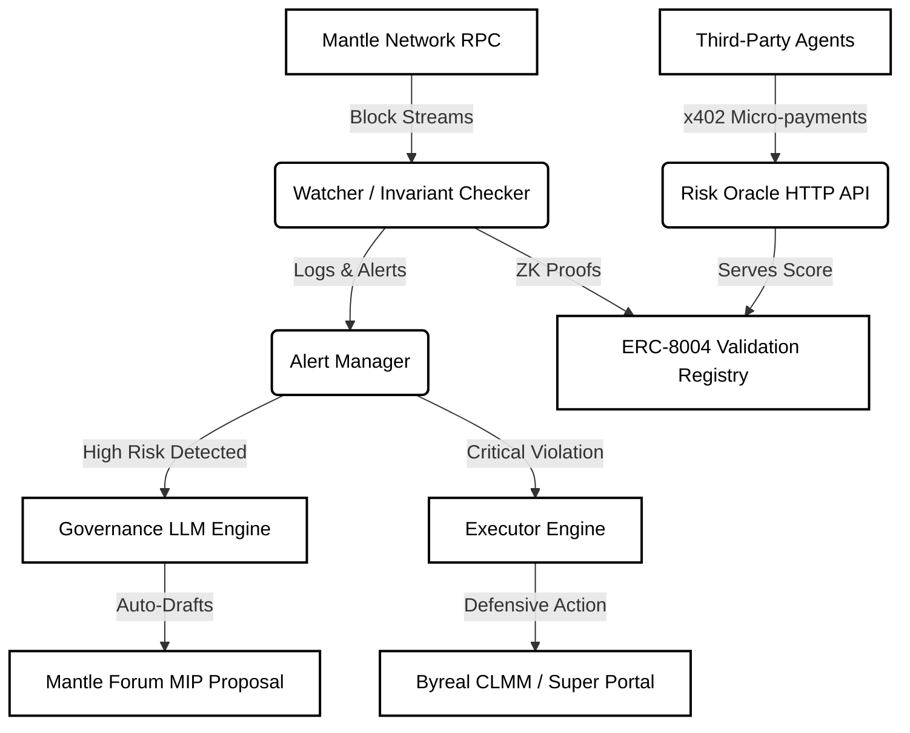
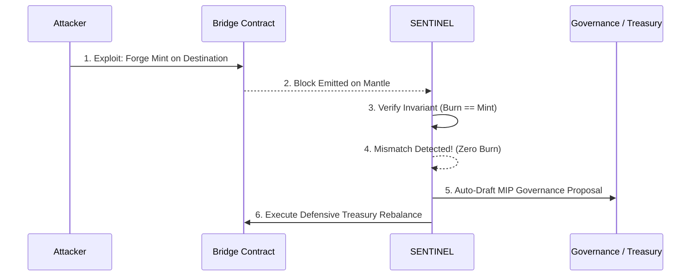

# SENTINEL

**Mantle Turing Test Hackathon 2026 Submission**

SENTINEL is a fully autonomous AI agent that continuously monitors cross-chain bridges on the Mantle network. By mathematically validating cross-chain invariants (e.g. `minted == burned`) in real-time, it detects exploits within seconds of them occurring—long before human teams can react. When a systemic threat is detected, SENTINEL instantly drafts a Mantle Governance Proposal (MIP) to defensively reposition the Mantle Treasury and automatically executes pre-authorized smart contract actions to minimize collateral damage.

Beyond emergency response, SENTINEL operates as a self-sustaining public good. It acts as an ERC-8004 Risk Oracle, selling its ZK-proven risk assessments to other AI agents and protocols via x402 micro-payments, using the revenue to fund its own gas costs.

## Architecture Diagram



## Exploit Response Workflow



## Getting Started

1. **Start the Backend Infrastructure:**
   ```bash
   cd backend
   pnpm dev
   ```
2. **Start the Frontend Threat Map:**
   ```bash
   cd frontend
   pnpm dev
   ```
3. **View the Dashboard:** Open `http://localhost:3000`
